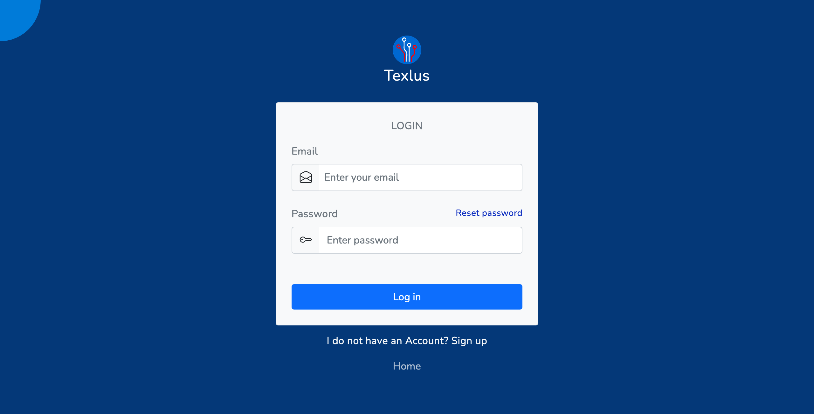
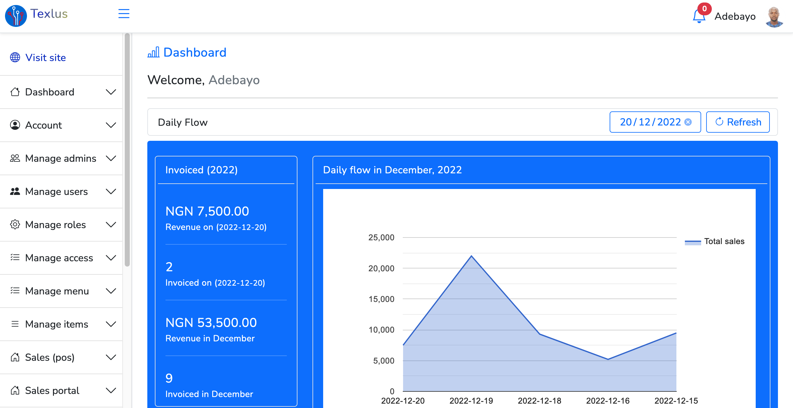
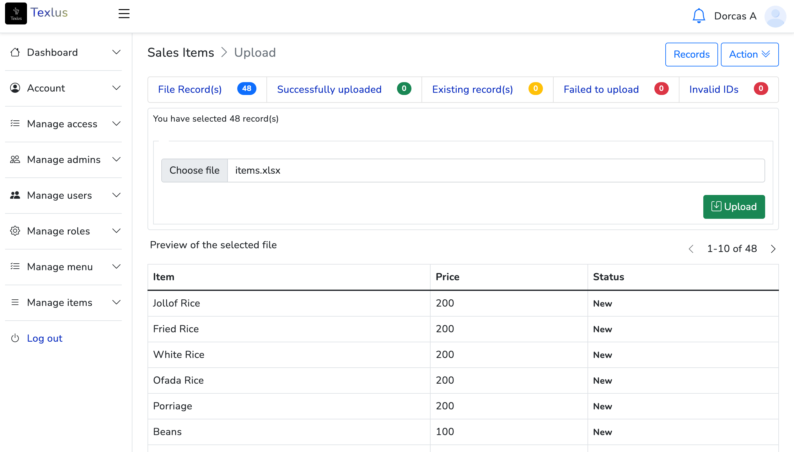
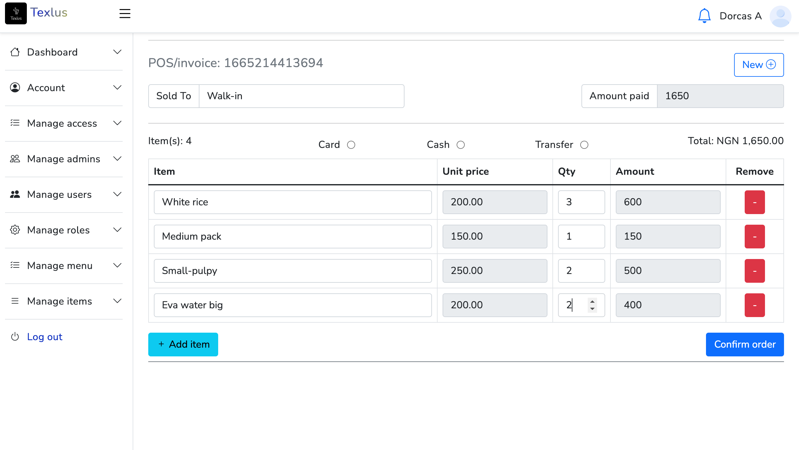
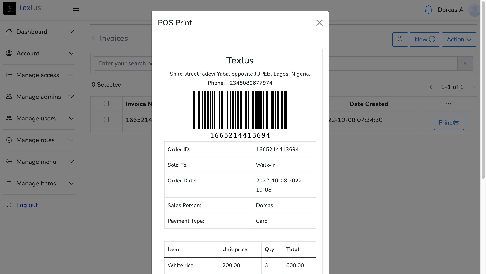

**Developer: Shuaib B. A.**

**Email: instructsme@gmail.com**

## POINT OF SALES APPLICATION BUILT WITH LARAVEL & VUEJS!

<!-- This project is an application built for point of sales for food restaurant, this can also as well be used for any other sales application.  -->
Texlus Application

## App Security
This is a Role-based application
 
## Requirements

1. Composer Installation
2. Mysql database
3. NodeJs Module
  
## Installation

- Make a pull request to extract this project to your project root folder.
- Initiate Node module in the root project
- Create MySql Database and setup a database name and password in the app settings.

## To run the App
At your root directory, Type: Change path to the **root folder**
To run, type: **php artisan serve**

## Database
Check the root folder

## Screenshots

**Sign In**

**Dashboard**

**Upload**

**POS**

**Invoice**

